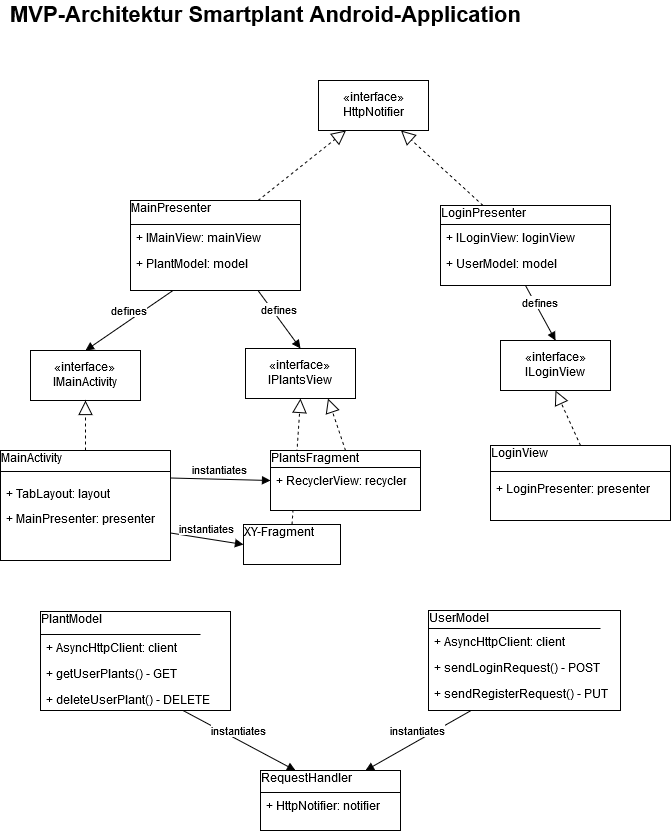
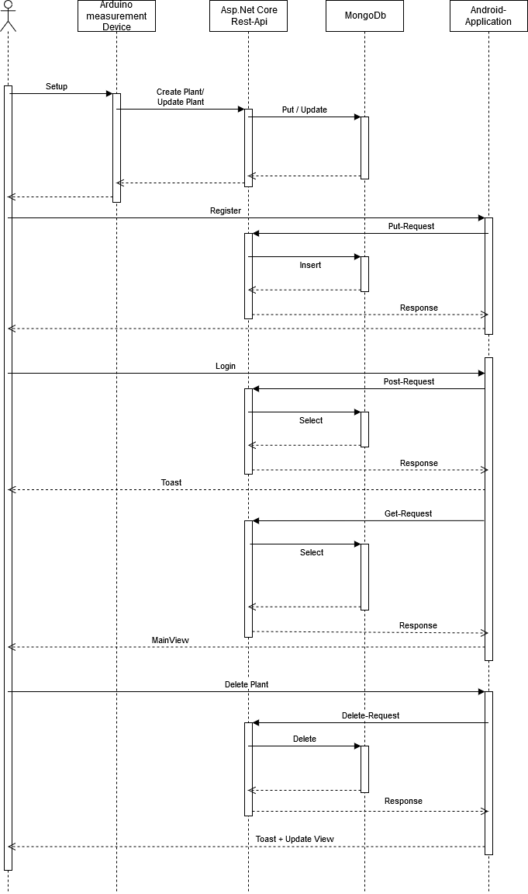

# SmartPlant_Ex1
Team: Moritz Schmidt (MSI-SE, 299562), Valentin Beck (MSI-SE, 294463)

## Beschreibung
Smartplant ist eine Android-Applikation zur Überwachung von Feuchtigkeitsständen verschiedener Hauspflanzen. Der User kann zu jeder selbst angelegten Pflanze Feuchtigkeitswerte auslesen um zu überprüfen wann die Pflanze wieder gegossen werden sollte. Außerdem lassen sich Zeitbezogene Daten auslesen um beispielsweise den Wasserverbrauch über einen Zeitraum analysieren zu können.
Die Kommunikation findet über eine ASP.Net Core Rest-Api statt. Als Datenbank wird MongoDb genutzt, eine dokumentenbasierte Datenbank.

## Projekt Struktur
Da das Projekt für Android entwickelt wird, bietet sich als Architektur das Model-View-Presenter Pattern an, welches folgendermaßen umgesetzt wird.

## Sequenzdiagramm der Applikation

## Branching Strategy 
Als Branching-Strategie werden Feature-Branches genutzt. Jedes Feature wird in einem eigenen Branch entwickelt und getestet. Der Master spiegelt zu jedem Zeitpunkt den aktuell getesteten Funktionsstand wieder.
